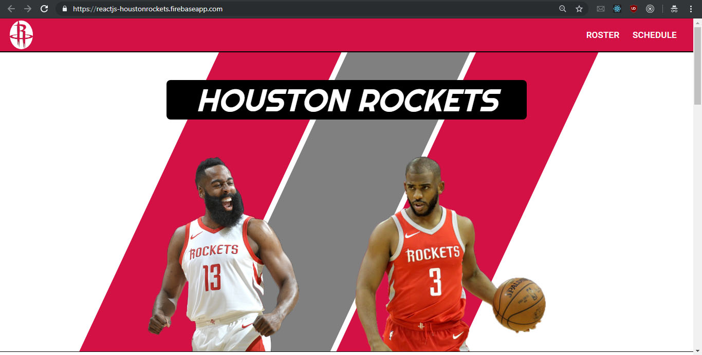

# ReactJS-HoustonRockets

***

\[**Description**\]
* This is a fan website that follows the Houston Rockets' players and schedule. Regular users can view the team roster, use filters to see the team schedule, or enter a raffle to win a free jersey. Authenticated users are given access to an admin dashboard where they can add or edit the players. The app is connected to a Firebase DB and also features eye-catching animations.

***

\[**Technologies**\]
* ReactJS, react-router, react-move, react-reveal
* @material-ui, d3-ease
* Firebase
* NBA API

***

\[**How to Run**\]
1. clone/download repo.
2. check that u have Node v14+ installed.
3. go to folder path and npm install.
4. npm start

* Or use deployment link: https://reactjs-houstonrockets.firebaseapp.com